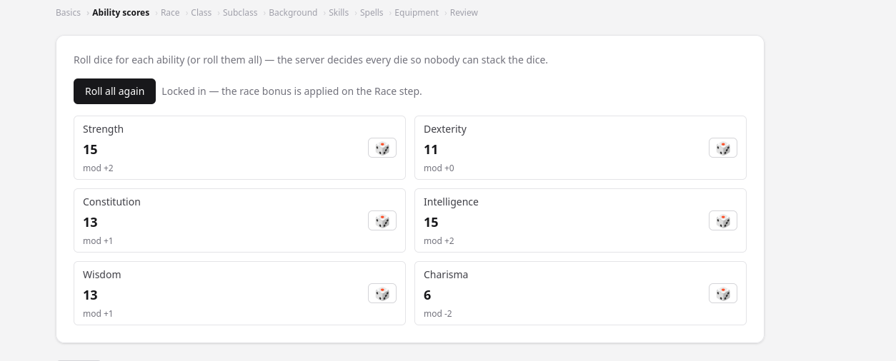

# fuzzy-happiness

A web platform for playing tabletop games with friends remotely — without having to
re-buy materials you already own. Multiple people join a shared session and interact
in real time, voice is provided through Discord, and character sheets are modelled per
game on top of a shared, portable base. Development targets **Dungeons & Dragons** first;
the core (users, sessions, characters, game registry) stays generic so other systems can
be added later.

## Why

This project came up as my son has friends moving away and they want to continue to play
DnD together. But not have to re-buy materials they already own from Roll20. So I told him
I would give it a try and see what I can do. I would call it an interesting side project
if nothing else.

## Core ideas

- **Real-time sessions** — multiple people in one room, sharing chat, presence, dice and
  table state over a WebSocket.
- **Games as plug-ins** — an abstract `Character` base holds what translates across games;
  each game (starting with D&D 5e) contributes its own concrete sheet.
- **Rules data from the 5e SRD API** — the D&D plug-in is backed by the open, no-auth
  [5e-bits SRD API](https://5e-bits.github.io/docs/introduction) (dnd5eapi.co): races,
  classes, spells, equipment and more are fetched through the **egress gateway** (single
  outbound path) and cached, so no rules data is hard-coded into the app.
- **Deterministic monster builder** — GMs generate a full homebrew statblock from a Challenge
  Rating and a combat role (or `auto`, inferred from a concept), then drop it onto the battle
  map. Stats come from an official DMG CR curve so the "AI" never picks numbers (§9b).
- **Discord for voice** — connect your Discord account and jump into a voice channel;
  the web app runs beside it as the shared game table.
- **Database** — H2 while developing; **PostgreSQL** (Railway-managed) in production (§19).

## Tech stack

- Frontend: `tabletopweb/` — React 19, Vite 8, plain JSX (oxlint, Vitest), Tailwind CSS v4, react-router, Node 24
- Backend: `tabletopserv/` — Spring Boot 4.1.1, Java 21, **multi-module Maven reactor**
  - `tabletopapi` — inbound REST contract only (interfaces + DTOs, `com.gamer.fowever.tabletopapi`)
  - `tabletopservice` — implementations, domain, repos, security, STOMP glue, runnable JAR (`com.gamer.fowever.tabletopservice`)
  - `tabletopfunctionaltest` — functional/E2E suites (§18): boots the packaged JAR subprocess against Testcontainers Postgres + a recorded-fixture gateway stub; `*IT` classes run under `./mvnw verify`
- Gateway: `tabletopgateway/` — Express 5, Node 24, ESM; egress-only proxy with a native `fetch`-based forwarder (SRD + future LLM, deny-by-default, `X-Gateway-Token`, TTL cache + stale fallback)
- Auth: Spring Security — 24h JWT bearer (jjwt), bcrypt, `USER`/`MODERATOR`/`ADMIN` roles,
  email verification + resend cooldown, confirm-password + real-name registration, and
  **PII encrypted at rest** (AES-256-GCM with an `emailKey` blind index); CORS for the Vite
  dev origin
- Rules data: D&D 5e SRD API (5e-bits/dnd5eapi.co) → **gateway** (`/api/srd/*`) → Spring; cached at the gateway (long TTL on lists)
- Persistence: JPA (H2 dev / PostgreSQL prod via Spring profiles)

See `AGENTS.md` for repo layout, commands, and conventions.

## Status

Iterative build; design draft in [`draft-design.md`](draft-design.md) (Draft v0.15).

Delivered:

- Core domain model + JPA persistence (users, games, characters, sessions) — `feature/java-start` (PR #9).
- Accounts & auth — `feature/spring-security`: register / login (username or email), 24h JWT,
  roles, bcrypt, email verification with resend; bootstrap admin in dev. 61 backend tests,
  jacoco line-coverage gate ≥ 90%.
- Frontend auth slice + app shell — `feature/frontend-auth`: register / login / email-verify
  pages, protected dashboard with stub session & character cards, auth state in
  `src/auth/` (localStorage + context), Tailwind UI. Backend CORS added for the dev origin.
  Node 24 enforced across the frontend (`.nvmrc`, `engines`, CI). 32 frontend tests (Vitest).
- Sessions & live chat — `feature/sessions`: **Stage 1 complete**. Backend: session REST
  (`POST /api/sessions`, `POST /api/sessions/join`, `POST /api/sessions/{id}/leave`).
  `GET /api/sessions/{id}` snapshot, `GET /api/games`, and STOMP over `/ws?token=<jwt>` with
  membership-private topics (`/topic/sessions/{id}`) and `@SubscribeMapping` snapshot replay
  (`/app/sessions/{id}`). `StompAuthChannelInterceptor` returns STOMP ERROR frames to
  unauthenticated/non-member clients. 101 backend tests, jacoco gate met. Frontend: lobby
  (`/sessions`) with create/join-by-invite-code and a live session screen (`/sessions/:id`)
  with roster, invite code and chat/presence over `@stomp/stompjs` (`src/lib/stomp.js`),
  Sessions nav enabled. 57 frontend tests (Vitest), oxlint + build clean.
- Game table slice 1 — battle map — `feature/battle-map`: **Stage 3 track 1**. Backend: grid
  map per session (`GET|POST /api/sessions/{id}/map`), tokens
  (`POST|PATCH|DELETE /api/sessions/{id}/map/tokens[/{id}]`), movement
  (`POST …/map/tokens/{id}/move`) enforced server-side against a per-turn budget
  (`floor(speed/10ft)` squares, Chebyshev diagonal cost), turn control
  (`POST …/map/turn` — `START|END|NEW_ROUND`), participant auto-tokens, and a new `TABLE`
  session-event type broadcasting the full map state on `/topic/sessions/{id}`. 131 backend
  tests, jacoco gate met. Frontend: `src/lib/mapGeometry.js` (race→speed table, reachability),
  `src/lib/battleMap.js`, and `BattleMapPanel` on the session screen — render grid + tokens,
  select-to-move with reachable-square overlay, GM add/edit/remove tokens + turn bar, TABLE
  events kept out of the chat feed and applied to the live map. 88 frontend tests (Vitest),
  oxlint + build clean.
- Game table slice 2 — dice & initiative — `feature/dice-initiative`: **Stage 3 track 2**.
  Backend: `POST /api/sessions/{id}/roll` with a validated dice grammar (`(\d+)?d(\d{1,3})
  ([+-]\d{1,3})?`, ≤ 20 dice / 999 sides / mod ±100) — public rolls persist a `DICE`
  `SessionEvent` broadcasting the full result; GM-private rolls broadcast a hidden frame on
  the topic and deliver the full frame only to the GM's `/user/queue/dice`. Initiative per
  map: `POST …/map/initiative` (replace order from labels/tokens, blank score auto-rolls d20),
  `POST …/map/initiative/{entryId}/reroll`, `POST …/map/initiative/next` (advances the pointer
  and activates the entry's token), `DELETE …/map/initiative/{entryId}`; `BattleMapDto` now
  carries `initiativeIndex` + ordered `initiative`. 164 backend tests, jacoco gate met.
  Frontend: `DiceTray` + `DICE` feed rows (hidden rolls shown fully only to the GM, merged by
  `rollId`), `InitiativeRail` (GM add/reroll/remove/advance, current-turn highlight on the map
  DTO), `/user/queue/dice` subscription in `src/lib/stomp.js`. 115 frontend tests (Vitest),
  oxlint + build clean.
- Design flush (no code) — `feature/gateway-monster-3d`: Draft v0.9 documents three researched
  areas in `draft-design.md`: homebrew **monster generation** (§9b — replicate the Cros.land
  CR-driven "chassis" math engine + our own LLM; the original has no public API), a dedicated
  **Express egress gateway** (§16 — `tabletopgateway/`, all outbound SRD/LLM calls route
  through it), and an optional **3D battle-map viewport** via React Three Fiber + drei (§17).
- **Backend restructure + gateway + SRD rewire** — `feature/backend-modules-gateway`
  (Draft v0.10, §18): `tabletopserv/` is now a **multi-module Maven reactor** — `tabletopapi`
  (interfaces + DTOs) on top of `tabletopservice` (implementations + runnable; jacoco ≥ 90%
  on service only). The **Express egress gateway** (`tabletopgateway/`) is the only outbound
  path (SSRF guard, `X-Gateway-Token`, SRD TTL cache, `502 {status,message}` on upstream
  failure). SRD data now flows `Spring → gateway → dnd5eapi.co`: `GET /api/srd/{collection}[/{index}]`
  with curated query passthrough.
- **Homebrew monster generation** — `feature/monster-generation` (Draft v0.11, §9b).
  Backend: the deterministic `MonsterMathEngine` (official DMG CR curve 0–30 incl. fractions,
  §9b combat-role shifts + Auto keyword resolution, size ladder, templated traits/actions and
  flavor) in `tabletopservice`; a `Monster` JPA entity owned by the creating GM; `POST
  /api/monsters/generate` (201) + `GET /api/monsters/mine` (interfaces in `tabletopapi`).
  Generation is fully local — the deferred LLM flavor is the only gateway-backed piece. 199
backend tests, jacoco gate met. Frontend: `src/lib/monsters.js` (CR/role/edition constants +
   API helpers) and a GM-only `MonsterGenerator` panel on the session screen — pick CR/role/
   edition, give it a name/concept, preview the statblock, "Add to map" as a `MONSTER_NPC`
   token, and reuse any saved monster from "My monsters". 127 frontend tests (Vitest),
   oxlint + build clean.
- **Railway deploy scaffold** — `feature/railway-deploy` (Draft v0.12, §19). Decision: the MVP
  runs on **Railway** (Hobby plan, Railway-provided `*.up.railway.app` domains, manual CLI
  deploys, Infrastructure-as-Code via `.railway/railway.ts` — Railway's legacy `railway.toml`
  is deprecated with a 2026-12-01 cutoff). The live web entry point is the custom domain
  **`gamenight.bond`** (+ `www`), registered through Railway so DNS + TLS are auto-managed.
  Backend gains a `prod` profile wired for
  Railway-managed Postgres (`server.port=${PORT:8080}`, datasource from `PGHOST/PGPORT/
  PGDATABASE/PGUSER/PGPASSWORD`, `ddl-auto: validate`) and an Actuator `/actuator/health`
  health-check endpoint (`permitAll`). The gateway binds `PORT` → `GATEWAY_PORT` → 3001 and
  `0.0.0.0` when a container `PORT` exists (`resolveListenConfig`); the web app ships as nginx
  serving the Vite build behind a React-Router SPA fallback. Dockerfiles for `tabletopserv/`
  and `tabletopweb/`, plus [Deployment](#deployment-railway) docs.
- **Character generation (R13)** — `feature/chargen`. Backend: `CharacterApi` with
  draft→compile→finalize in `CharacterService` + `ChargenRules`, `ScoreSource` (standard
  array default, point-buy, 4d6-drop-lowest, house-rule 6×d20), `POST /api/characters/compile`
  (validates choices + derives stats, returns 200 `CompileResult` even when illegal),
  `POST /api/characters/generate` (random quick-build), `GET|POST /api/users/me/characters`
  and `GET /api/users/me/characters/{id}`; persisted `Dnd5eCharacter` with a JSON display
  snapshot. SRD allowlists updated (gateway + `SrdClient` now include `backgrounds`).
  `CharacterJourneyIT` (6 journeys) added to the functional suite. 224 backend tests, jacoco
  92.87%. Frontend: `src/lib/characters.js` + `srd.js` (API/catalog layer), `CharactersPage`
  (list + "surprise me" quick-build with preview and save), `CharacterWizardPage` (10-step
  guided flow with client-side caps mirroring the server rules), `CharacterSheetPage` (read-only
  stat blocks, scores, skills, spells, equipment). Routes `/characters`,
  `/characters/new`, `/characters/:id` live; nav link enabled; Dashboard cards updated.
  154 frontend tests, oxlint + build clean.
- **Chargen hardening R23/R25** — `feature/chargen-wizard-rolls` (Draft v0.15, §8). Rolled
  score sources are **server-enforced** via `POST /api/characters/roll-scores` (the wizard's
  score inputs lock until a server roll lands); standard array / point-buy stay constrained
  assignment. The wizard tracks **base scores** and applies the **race ability bonus** on race
  pick, so racial-bonus characters compile without manual inflation. Starting equipment
  becomes a **gold-budget shop** tied to the class's PHB starting wealth (compile rejects
  over-budget kits); the sheet gains `startingGoldGp`/`spentGoldGp` **in the snapshot only**
  (no prod DDL). 239 backend tests (jacoco ≥90%) and 169 frontend tests, lint + build clean.
- **Chargen dice & gold fix (R28)** — `feature/chargen-dice-and-gold` (Draft v0.16, §8).
  Rolled methods are now the **default** score source with **per-ability 🎲 roll buttons** and a
  "Roll all ability scores" button (server-authoritative, ~2 s animated running number — no
  arrow/stepper inputs for rolled methods). The race-bonus map is keyed to **full ability names**
  so quick-build restore seeds base scores by removing the bonus exactly once (no double-apply),
  and the point-buy total ignores unassigned scores. The equipment shop now **fetches live SRD
  `cost` for every picked item** (static map is display bootstrap only), reports unpriced items
  with a retry, and the **class kit auto-trims itself to the starting-gold budget** — so the
  wizard's spent total always matches what compile charges (regression-pinned at 20 gp in the
  functional fixtures). 239+ backend tests (jacoco ≥90%) and 186 frontend tests, lint + build
  clean.
- **Backend functional/E2E module** — `feature/functional-tests` (Draft v0.13, §18). The
  `tabletopfunctionaltest` module goes live: `maven-failsafe-plugin` binds `*IT` journey
  classes (auth, session/STOMP, dice, battle map/initiative, monster, SRD) to `verify`, so
  `./mvnw test` stays unit-only and `./mvnw verify` builds the packaged JAR, boots it as a
  subprocess against a **Testcontainers Postgres** (dev profile + env overrides, zero app-code
  change) plus a **recorded-fixture gateway stub**, and drives the real HTTP/WebSocket
  interfaces — email-verify tokens parsed from the child JVM log. CI (`maven.yml`) now runs
  `./mvnw -B verify` on every push/PR to `develop`. Jenkins decision (advisory): not adopted;
  GH Actions + manual `railway up` cover CI/CD for now.
- **Account username changes + dragon theming** — `feature/username-change-and-dragon-bg`
  (R21/R22). Backend: `PATCH /api/users/me/username` (interface in `tabletopapi`, impl in
  `MeControllerImpl`, case-insensitive uniqueness excluding self, 409 on taken, no-op short
  circuit) plus 2 unit, 2 web and 2 functional journeys. Frontend: a `/settings` page with a
  username-change form (`src/lib/api.js#updateUsername`), `refreshMe` now persists the refreshed
  profile to `localStorage`, and the sign-in/sign-up screens share an `AuthBackground` component
  using the Pixabay-licensed dragon image (`public/dragon-bg.jpg`, photo 9728447) over a dark
  overlay. 162 frontend tests (Vitest), oxlint + build clean.
- **Resilient verification emailing** — `feature/registration-smtp-resilience`
  (R26). The verification-email send is non-fatal: a delivery failure logs a WARN, keeps the
  created account and its persisted token, and leaves `/api/auth/verify` +
  `/api/auth/resend-verification` working once mail is configured (previously a send failure
  inside the @Transactional `register()` 500'd and rolled the account back — observed live on
  prod where `SMTP_*` is still unset, see [`draft-design.md` §19](draft-design.md)). 2 new unit
  tests; `./mvnw test` 241 green, jacoco ≥90% met.
- **Profile editing + password change** — `feature/profile-and-password`
  (R27). Signed-in users can now edit their display name and real name
  (`PATCH /api/users/me/profile`, `AuthService.updateProfile`) and change their password
  (`PATCH /api/users/me/password` — current password verified against the BCrypt hash, the same
  password policy regex enforced, confirm field required). Email and date of birth stay
  read-only. The `/settings` page gains two panels ("Edit profile" + "Change password") in the
  existing inline-style forms; existing JWTs remain valid after a change (no token-version
  revocation, matching username changes). 6 new backend tests (`./mvnw test` 247 green, jacoco
  ≥90% met — incl. functional `editsProfileAndChangesPassword` IT) and 9 new frontend tests
  (177 Vitest green, oxlint + build clean).

Next: production deploys (R14 — Railway auto-deploy from GitHub, rootDirectory per service), the
optional 3D viewport (§17), and the rest of the game table (multi-map, fog of war, turn timers,
conditions). The out-of-MVP list lives in [Wants.md](Wants.md).

## Deployment (Railway)

One project, three services + managed Postgres, connected over **private networking**
(`<service>.railway.internal` — the gateway keeps **no public domain**). Full spec in
[draft-design.md §19](draft-design.md#19-deployment-railway).

| Service | App dir | Build | Health check |
|---|---|---|---|
| `backend` | `tabletopserv/` | `Dockerfile` (Maven → temurin JRE) | `/actuator/health` |
| `gateway` | `tabletopgateway/` | Railpack (Node 24) | `/health` |
| `web` | `tabletopweb/` | `Dockerfile` (node build → nginx) | `/` |
| `postgres` | managed | Railway Postgres | — |

Lifecycle: `railway login` → `railway link` → `railway config plan`/`config apply`
(scaffolds Postgres + services from `.railway/railway.ts`) → set dashboard secrets per
service → `cd tabletopgateway && railway up`, `cd tabletopserv && railway up`,
`cd tabletopweb && railway up` (gateway first — the backend needs `GATEWAY_URL` to resolve).

### Variables

Dashboard secrets per service; `.railway/railway.ts` marks them `preserve()` so `config apply`
never clobbers them.

- **backend:** `SPRING_PROFILES_ACTIVE=prod`, `JWT_SECRET`, `PII_SECRET`,
  `ADMIN_USERNAME` `ADMIN_PASSWORD`, `SMTP_HOST` `SMTP_PORT` `SMTP_USER` `SMTP_PASSWORD`,
  `CORS_ALLOWED_ORIGINS` (`https://gamenight.bond`, `https://www.gamenight.bond`, and the web
  service's `*.up.railway.app` URL), `FRONTEND_URL=https://gamenight.bond`,
  `GATEWAY_URL` (`http://gateway.railway.internal`), `GATEWAY_TOKEN`; datasource `PGHOST`
  `PGPORT` `PGDATABASE` `PGUSER` `PGPASSWORD` (referenced from the Postgres service).
- **gateway:** `GATEWAY_TOKEN` (same value as backend).
- **web:** `VITE_API_URL` (backend public URL) — read at **build time**, so change it and
  redeploy.

Local dev keeps its defaults: `tabletopserv.*` env overrides (`CORS_ALLOWED_ORIGINS`,
`GATEWAY_URL`, `GATEWAY_TOKEN`, …) per `application.properties`.
